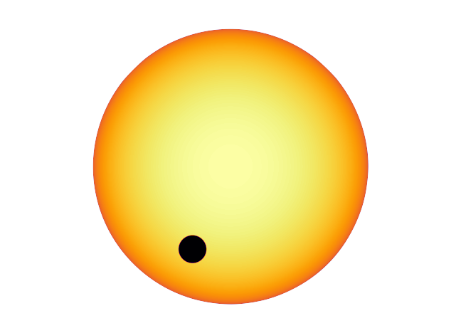

# flatstar

`flatstar` is a pure-Python tool for drawing stellar disks with scientifically-accurate limb darkening. Each pixel has an accurate fractional intensity in relation to the total stellar intensity of `1.0`. It is ideal for ray-tracing simulations of stars and planetary transits.



## Features

* Blazing fast! There are no for-loops involved, only `numpy` arrays manipulation and `pillow` Image objects.
* It has the most well-known limb-darkening laws: linear, quadratic, square-root, logarithmic, exponential, Sing et al. (2009), Claret et al. (2000).
* You can implement your own custom limb-darkening law.
* Supersampling for the situations where you need coarse arrays but do not want to lose precision in stellar disk intensity (i.e., no hard pixel boundaries).
* Resampling is done with the C-libraries of `pillow`, which means they are as fast as it goes.

## Installation

For now there is only one way to install `flatstar`: compiling from source.

### Compile from source (development version)

First clone this repository and navigate to it:

```angular2html
git clone https://github.com/ladsantos/flatstar.git && cd flatstar
```

And now install it:

```angular2html
python setup.py install
```